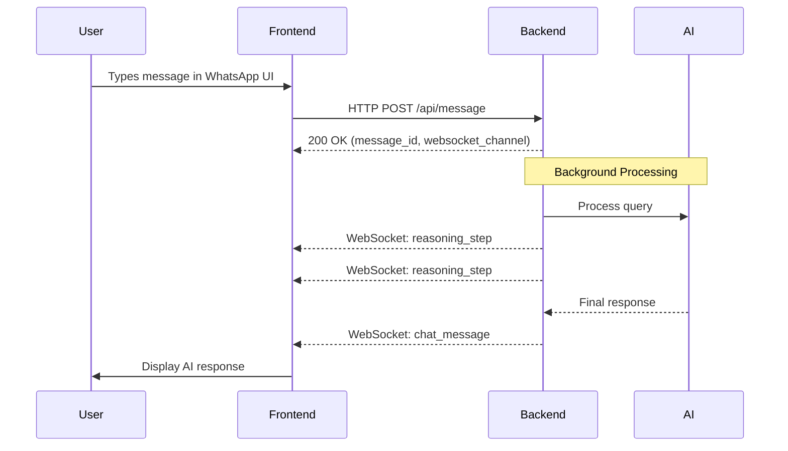

# WhatsApp Chat Integration - Diagnostic & Fix

## Summary

✅ **Backend is working perfectly** - Verified with test script
❌ **Frontend had incorrect WebSocket message flow** - Now fixed

---

## Problem Identified

The frontend's `useWebSocket` hook was trying to send messages **directly through WebSocket**, but the backend architecture requires:

1. ✅ Send messages via **HTTP POST** to `/api/message`
2. ✅ Backend processes in background
3. ✅ Backend streams updates via **WebSocket**

---

## What Was Fixed

### File: `kirana-frontend/hooks/useWebSocket.ts`

**Before (Incorrect):**
```typescript
// ❌ Trying to send directly through WebSocket
wsClientRef.current.sendMessage(messageType, content);
```

**After (Correct):**
```typescript
// ✅ Send via HTTP POST API
const { api } = await import('@/lib/api');
const response = await api.sendMessage({
  store_id: storeId,
  message_type: messageType,
  content: content,
  language: useStore.getState().ui.language,
});
```

---

## Backend Test Results

Created test script: `kirana-backend/UCs/test_whatsapp_integration.py`

**Test Output:**
```
✅ WebSocket connected
✅ HTTP POST returned 200 with message_id
✅ Received reasoning_step events via WebSocket
✅ Received final chat_message event via WebSocket

Query: "Maggi ka stock kitna hai?"
Response: "Rajesh bhai, aapke paas abhi **65 Maggi packets** hain..."
```

**Backend is working perfectly!** 🎉

---

## Expected Flow (Now Implemented)



---

## Testing the Fix

### 1. Start Backend
```bash
cd kirana-backend
source venv/bin/activate
python main.py
```

### 2. Start Frontend
```bash
cd kirana-frontend
npm run dev
```

### 3. Open Browser
Navigate to: http://localhost:3000

### 4. Test WhatsApp Chat
1. Type a message in the WhatsApp mock UI (left panel)
2. You should see:
   - ✅ Your message appears immediately
   - ✅ AI reasoning steps appear in middle panel
   - ✅ Final AI response appears in chat

---

## Example Queries to Test

### Simple Query (UC2)
```
Kya order karein aaj?
```

### Inventory Check
```
Maggi ka stock kitna hai?
```

### Festival Preparation (UC1)
```
Holi aa rahi hai, kya mangana chahiye?
```

---

## Configuration Verified

**Environment (.env.local):**
- ✅ `NEXT_PUBLIC_USE_MOCK_API=false` (using real backend)
- ✅ `NEXT_PUBLIC_API_BASE_URL=http://localhost:8000`
- ✅ `NEXT_PUBLIC_WS_BASE_URL=ws://localhost:8000`

---

## Files Modified

1. ✅ `kirana-frontend/hooks/useWebSocket.ts` - Fixed sendMessage to use HTTP POST
2. ✅ `kirana-backend/UCs/test_whatsapp_integration.py` - Added diagnostic test

---

## What the UC Test Files Show

Both `test_uc1_full.py` and `test_uc2_full.py` demonstrate the **correct flow**:

1. Connect to WebSocket
2. Send HTTP POST to `/api/message`
3. Listen for WebSocket events

The frontend now follows the same pattern!

---

## Next Steps

1. ✅ Backend verified working
2. ✅ Frontend WebSocket hook fixed
3. 🔄 **Restart frontend dev server** to apply changes
4. 🧪 Test with WhatsApp UI in browser

---

## Notes

- The backend processes messages asynchronously and streams updates via WebSocket
- This allows the UI to show real-time reasoning steps
- The fix ensures frontend follows the same pattern as the working UC tests
